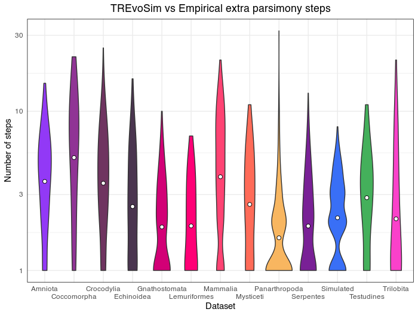
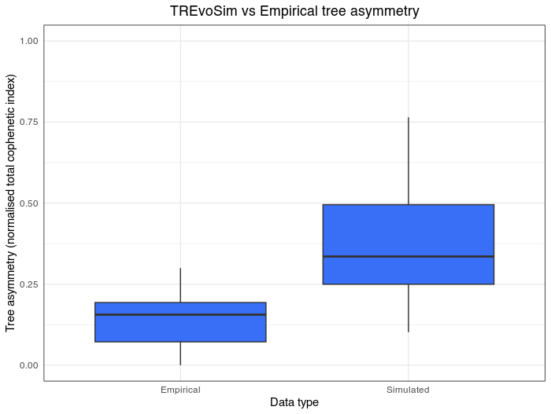
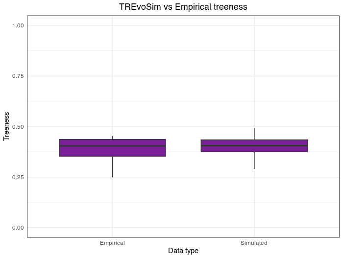

.. _algorithmconcepts:

Algorithm and Concepts
=======================

TREvoSim Algorithm Description
------------------------------

To do. 

Tree Rooting
------------

TREvoSim trees differ in some respects from how we typically think of empirical trees, and this is particularly true when it comes to rooting. If we consider the root to be the last common ancestor of everything in the tree (a relatively common definition, most often applied to a species), then this will be -- in our case -- an early individual within species zero, but not species zero itself. Due to the nature of the TREvoSim algorithm under many settings, species zero will remain in existence for a significant period of time after the existence of this individual (the simulation is initialised with a playing field full of clones of a species zero individual, and so this species will takes longer to go extinct than most others), allowing the population of species zero organisms to further diversify, and give birth to other species. As such, if we consider the root to be the oldest point in a tree, it will be the node splitting species zero (and typically its associated clade) from species one. Species zero may nest uptree somewhere: as a species it has the oldest origin, but typically an extinction later than a number of other taxa in the tree, and it is a direct ancestor of a number of the species in a tree (the genome is written at extinction by default, and so its characters best represent its latest state). Given this, TREvoSim roots on the earliest node, rather than species zero- i.e. the root lies between species 1 and (assuming this species does not evolve into its own clade, which is often the case), the other taxa. Typically, this distinction (between the individual and the species) matters most where character polarisation is important, as opposed to the tree topology per se. Given this, there is the option to output character states at the root (i.e. the organism that is used to seed the simulation) in the logs (see :ref:`loggingsim` ).

Default settings
----------------

TREvoSim's default simulation parameters are chosen so as to represent a sensible place to start with phylogenetic questions in mind. One hundred outputs from runs made using the default parameters are included in the repository (folder /comparison_to_empirical_data/TREvoSim_output_defaults_2024/), in addition to twelve empirical, total evidence datasets (folder /comparison_to_empirical_data/Empirical_data/ ;  data source can be found in Mongiardino Koch et al. 2021, see :ref:`index`). Also in the folder /comparison_to_empirical_data/ is an R script that compares three aspects of the output data to the properties of the empirical trees/data, outlined below. This script can either be run within R by following the instructions to update the working directory within the R script, or on systems that can run a bash script, by providing the file run_rscript.sh with execute permissions and running it, which by default outputs comparison graphs (below) to /comparison_to_empirical_data/Graphs_out. The script can be modified to quantify other outputs as desired; if you would like to add further quantification to the script but are not able to do so, feel free to raise an issue (see :ref:`Issues and support`).

Homoplasy - Extra steps
^^^^^^^^^^^^^^^^^^^^^^^

To quantify the homoplasy within data generated under default settings, the script graphs the average number of extra steps for each character for the empirical datasets (evaluated against the total evidence tree), and for the simulated data (evaluated against the true tree). This comparison is shown in the violin plot below:

The TREvoSim data ("simulated"; actually the results for all characters of the first 25 replicates provided with in the repository) is shown in blue third from the right, all other datasets are labelled with taxonomic group, and represent the distribution of extra steps for all characters in the analysis. Note the log scale on the Y axis. The dots show the mean for each dataset. The number of extra steps against the comparison tree of choice (total evidence for empirical, true tree for TREvoSim data), is comparable across datasets.

Tree shape - Asymmetry
^^^^^^^^^^^^^^^^^^^^^^

The tree asymmetry (= imbalance), is also calculated from the script. The box plots below show the asymmetry for all TREvoSim trees (100 replicates) next to those for all empirical trees (twelve total evidence analyses) quantified through the total cophenetic index normalised against the maximum possible value:

TREvoSim trees ("simulated") have a wider range of asymmetries than is present in the empirical data (although the box plot also represents a higher number of data points). The mean demonstrates that TREvoSim trees are generally more asymmetrical than empirical datasets.

Tree shape - Treeness
^^^^^^^^^^^^^^^^^^^^^

The script also provides a quantification of the normalised treeness (=stemminess) of a tree: the fraction of total tree length that is on internal branches of the tree. This comparison is shown in the box plots below, between 100 TREvoSim replicates and the 12 total evidence trees:

TREvoSim ("simulated") trees have a similar mean, and spread, of normalised treeness values to that found in empirical data. 
