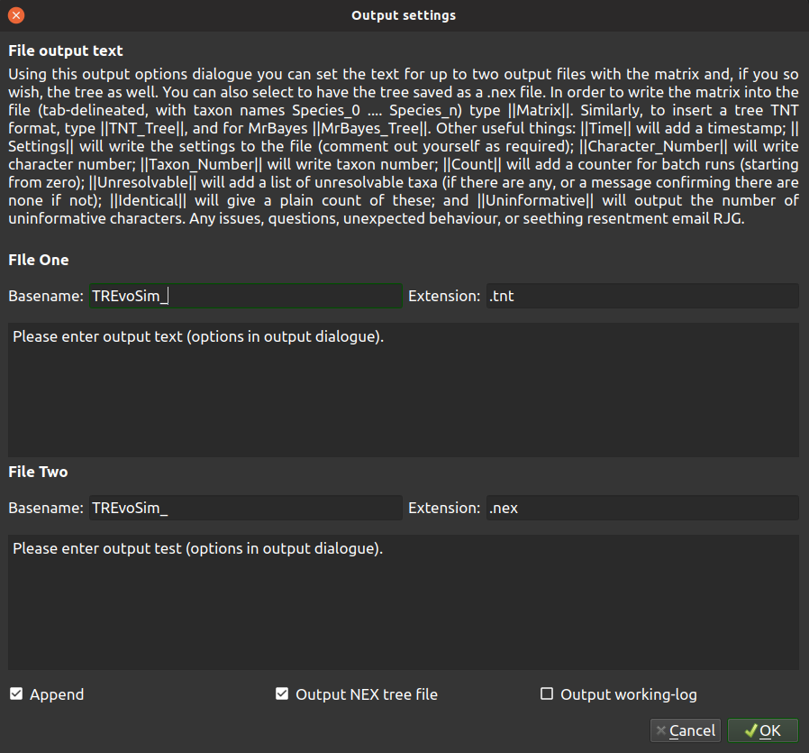
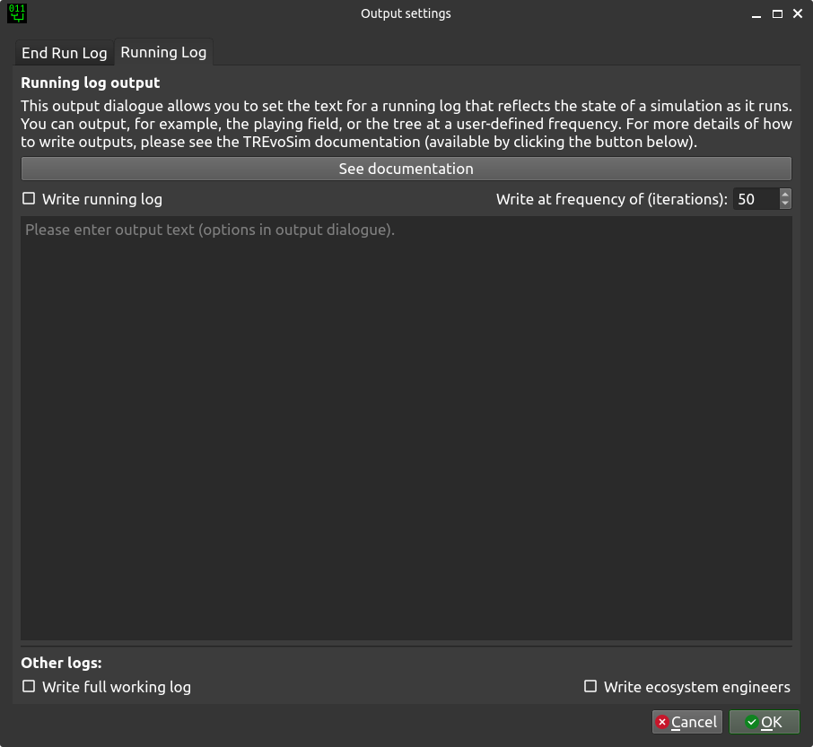

.. _loggingsim:

Logging the Simulation
======================

Logging system
--------------

End run log
^^^^^^^^^^^

TREvoSim has a versatile logging system which allows the user to define outputs in a range of formats required for phylogenetic inference packages, or e.g. R, provided these allow plain text inputs. Clicking on the output button of the toolbar will launch the output dialogue, which has two tabs. The first is a log that is output at the end of the run:

A typical use case for this is when you would like to use the outputs of a finished simulation to do downstream analyses for e.g. phylogenetic methods. This tab provides options for two custom log files, which are placed, after a run, within the *TREvoSim_output* folder created on the save path. Basename defines the start of the filename, and if you so wish, this can include forward slashes before the start of the file name to denote a path, that TREvoSim will create for you. TREvoSim then adds a number to the start of the filename you have suggested, and this number iterates with subsequent runs. The file extension is also defined in this dialogue in a separate text box. 

The two text boxes allow custom file content to be written: text from these is written as provided to the file -- for example with run instructions or program commands -- and any of a series of keywords defined below included within two vertical bar ( | ) symbols are replaced as a file is written. The default outputs are shown in the figure above -- they create a vanilla nexus file which allows you to, for example, load the character matrix into R, and a TNT file which conducts a parsimony search on TREvoSim data before outputting the most parsimonious trees. 

In addition to these two custom files, TREvoSim can output a tree for each run in a standard nexus format. The options at the bottom of the output tab allow you to define the basename for this file. The output includes the tree and translate block, as well as a comment with the settings of the run written to it. 

Running log
^^^^^^^^^^^

The other tab is a running log which is output during a run:

This is of utility for studying processes as they occur during a run, as it is output on a regular basis as the simulation progresses. Any text entered into the Custom running log text box is output to a new file (appended with an iterator) at the requested frequency. This can be used to record anything in the state of the simulation required to study a process of interest. It uses the same keywords (shown below) as the end run log, outputting data in the current state for the iteration at which the log is written.

There are three further options at the base of the dialogue:

:Write running log: By default the running log is not created or written to when a simulation runs. In order to write the files this option needs to be enabled.
:Frequency: This dictates the frequency, in iterations, with which a new running log file is written. 
:Write full working log: When this is checked, TREvoSim outputs a text file that it appends to as it runs. This file outlines every step of each iteration, such as the state of the playing field, the environment, and the processes the software is going through. This helps understand and fact check any given run, but for significant playing field sizes, taxon numbers, or character numbers, it creates a large text file (10s -- 100s of MB). 
:Write ecosystem engineers: There is a custom log for simulations in which ecosystem engineers are enabled (the nature of this functionality does not allow all required information to be easily output using the running log: this is primarily a convenience function).

Keywords
--------

Keywords within two vertical bars ( e.g. \|\|Matrix\|\| ) are replaced as a file is written as follows:

:Character_Number: This outputs the character number.
:Count: This is replaced with a counter for batch runs; starting from zero and incrementing by one. This is padded with leading zeroes to three figures.
:Ecosystem_Engineers: This prints a list of species, and their ecosystem engineering status (i.e. whether any members of this species are ecosystem engineers).
:Iteration: This outputs the current iteration number. 
:Matrix: This is replaced with the matrix from the run.
:MrBayes_Tree: This writes a tree in standard Newick format, including branch lengths (these are based on iteration number throughout), e.g.

::

  (S_01:13,(S_02:8,(S_03:13,(S_04:32,((S_06:4,(S_07:10,(S_08:6,(S_09:5,(S_10:10,(S_11:6,(S_12:6,(S_13:2,(((S_22:11,(S_23:12,(S_24:9,((S_26:28,((S_28:37,(S_29:2,(S_30:2,(S_31:1,S_27:1):1):38):23):20,S_25:12):31):41,S_21:31):24):27):1):70,S_14:13):42,(S_15:21,(S_16:2,(S_17:11,(S_18:2,(S_19:10,(S_20:14,S_05:25):7):1):4):2):1):2):1):13):58):6):2):2):5):2):36,S_00:20):3):1):3):7):85

*Note* The mechanism used for tree writing differs between TNT and MrBayes outputs -- the tree topology is the same, but the taxon order differs.

:Root: Writes the genome of the organism used to seed the simulation, thereby allowing characters to be polarised correctly with respect to the root of the tree (see :ref:`algorithmconcepts`).
:Settings: Writes the settings to the file (this is provided as a useful way to record, with any output data, the set up for TREvoSim for any given run).
:TNT_Tree: This writes a tree, if required, in TNT format (i.e. only brackets and terminal labels), e.g.

::

  (((((00 (((((((((((((((05 20) 19) 18) 17) 16) 15) (14 ((((21 ((25 ((((27 31) 30) 29) 28)) 26)) 24) 23) 22))) 13) 12) 11) 10) 09) 08) 07) 06)) 04) 03) 02) 01)

*Note* The mechanism used for tree writing differs between TNT and MrBayes outputs -- the tree topology is the same, but the taxon order differs.

:Time: Adds a timestamp.
:Taxon_Number: Writes taxon number.
:Unresolvable: This prints a list of unresolvable taxa (or a notice that there are none if required).
:Uninformative: Writes the number of uninformative characters.

Keywords example 
^^^^^^^^^^^^^^^^

As an example, the following -- entered as one of the custom files at the end of the run -- would output a block of text that could be run as a macro in tnt:

::
 
  mxram 100;
  NSTATES nogaps;
  xread
  'Written on ||Time|| Variables: ||Settings||'
  ||Character_Number|| ||Taxon_Number||
  ||Matrix||
  ;
  piwe-;
  keep 0; hold 100000;
  rseed *;
  xmult = level 10; bbreak;
  export - TREvoSim_run_||Count||_mpts.nex;
  xwipe;

Should any other output options be required, please file a `feature request <https://github.com/palaeoware/trevosim/issues>`_. Keywords are not case sensitive.
