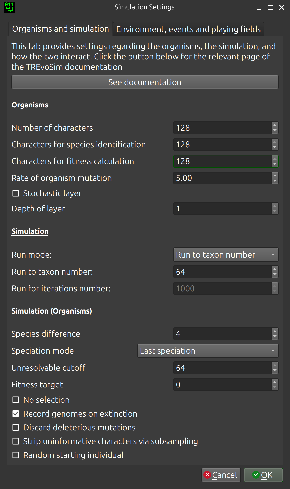

.. _settings:

Settings dialogue
=================

Clicking on the settings button of the toolbar will launch a settings dialogue which has two tabs - one with settings for the organisms in the simulation, and one controlling the environment for the simulation.

Organisms and simulation tab
----------------------------

**Organisms**

:Number of characters/genome size: This defines the number of bits in character string for each organism, and ultimately the character number of the matrix output by the software.
:Rate of organism mutation: This is the rate of mutation for the organisms in the simulation, in units of mutations per hundred characters per iteration.

**Simulations (Organisms)**

:Taxon number: A simulation will run until this number of species has evolved, and then terminate.
:Species difference: The hamming distance between a selected organism, post mutation, and either the character string when the species originated, or the last species to originate within the lineage (see paper for rationale) is used within the TREvoSim species concept. This setting defines the required hamming distance for a speciation to have occurred.
:Unresolvable cutoff: With low character numbers, especially when TREvoSim is set to strip out uninformative characters, terminals can have the same character string within a matrix, and thus be unresolvable. This setting defines upper limit for identical terminals. If there are more unresolvable taxa than this number in a single run, output files are not written and a warning is provided. If batch mode is underway, the current run is discarded and started again.
:Sansomian speciation: This option dictates when the character string of a species is recorded: at speciation, or at extinction. Sansomian speciation, the default, is to record the this when a species goes extinct. This ensures if it is a long-surviving species that the recorded characters string best reflects that closest to its sister group. When the option is not selected, genome is recorded at speciation.
:Discard deleterious mutations: Optionally, TREvoSim can accept only mutations which are neutral, or improve the fitness of an organism.
:Strip uninformative characters via subsampling: TREvoSim gives the option of writing matrices of only parsimony informative characters. When this option is checked, the software attempts to provide the requested character number of only informative characters. It achieves this by multiplying the number of characters and species difference by an empirically calculated factor (see below) at the start of a run. After a run has completed, informative characters are randomly subsampled to the requested number of characters; if there are not enough characters to achieve this, in batch mode the run is discarded and restarted, in single run mode an error message is provided.
:Recalculate multiplication factor on dialogue close: The multiplication factor required to achieve a set number of informative characters via subsampling depends on the settings of any given run. Selecting this option calculates and sets this factor empirically after the settings dialogue is closed by conducting a ten-run batch and working out the proportion of informative characters within those runs. This needs to be recalculated after any settings are changed. If it is not, or has not been set, the software will run with a large factor, and thus be slower than necessary.

Environment
-----------

.. figure:: _static/settings_02.png
    :align: center

**Environment**

:Rate of environmental mutation: The environment in TREvoSim - which comprises a series of random numbers, or masks - also mutates, allowing lineages to track fitness peaks. This setting dictates the rate of mutation for the environment, in units of mutations per hundred characters per iteration.
:Number of masks: This dictates the number of masks (random numbers) in the environment. The more there are the flatter the fitness landscape is likely to be.

**Simulation (Environment)**

:Playing field size: This dictates the size of the playing field within the simulation, i.e. the number of individuals alive at any given time. Small sizes will lend themselves to asymmetrical trees with short tips.
