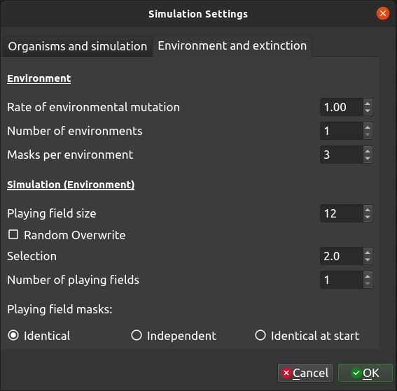

.. _settings2:

Settings - Environment and Extinction
=====================================

Clicking on the settings button of the toolbar will launch a settings dialogue which has two tabs - one with settings for the organisms in the simulation, and one controlling the environment for the simulation.

Environment
-----------

:Rate of environmental mutation: The environment in TREvoSim - which comprises a series of random numbers, or masks - also mutates, allowing lineages to track fitness peaks. This setting dictates the rate of mutation for the environment, in units of mutations per hundred characters per iteration.
:Number of environments: From v2.0.0 TREvoSim allows multiple environments (i.e. numerous sets of masks). During a simulation the fitness of each organism is calculated for every environment, and the organism's overall fitness is defined as that from the environment to which it is best suited (i.e. for which it has the highest fitness).
:Masks per environment: This dictates the number of masks (random numbers) in the environment. The more there are the flatter the fitness landscape is likely to be. This can be explored using the count peaks functionality. 

// MRS comment: It would be useful to remind the reader here that the fitness is calculated by summing the match between the genotype across all masks.
// MRS comment: Could you point the reader to the "count peaks" functionality – perhaps with a link to its manual page?

:Match peaks: When TREvoSim has multiple environments associated with a playing field, enabling this option ensures that at initialisation each environment has the same maximal fitness (i.e. fitness peak height). Note, that this is currently applied within, not across, playing fields, if the latter have different masks. When this setting is enabled, as well as achieving fitness peaks of the same height, TREvoSim will use a heuristic search to seed the simulation with the fittest organism it can that also has the same fitness for all environments (it achieves this in more than 99% of runs; if playing fields have different environments the algorithm will search for organism with the best mean fitness across playing fields). As currently formulated, once a simulation is running, mutations will cause peak fitnesses to diverge between environments (add mask / overwrite mask). 
:Ecosystem Engineers: From v3.0.0 TREvoSim allows organism-environment feedback through an ecosystem engineering functionality. When this option is enabled, ecosystem engineering starts at either half the requested iteration count, or after half the requested species have appeared. The first time EE occurs, a single, randomly-chosen individual is assigned "EE status" (as are any other individuals with identical genomes), and its genome is used as the basis for organism-environment feedback, as outlined below.This status is passed on to all offspring of this individual for the remainder of the run.
:EE mode: EE can either be applied once or persistently, defined by this pair of radio buttons. In single shot EE, engineers are applied once, half way through a simulation, as outlined above. In contrast, if this radio button is selected, then EE is applied repeatedly after its first application. The frequency at which this occurs is user-defined (see below). On reapplication, a random individual is chosen from within those individuals with EE status every reapplication as the basis for organism-environment feedback. If EEs have gone extinct, no action is taken. 
:EE Frequency: this is the frequency with which persistent EE are applied after the first application at half way through a run, in iterations. 
:EE mechanism: EE-based organism-environment feedback can occur in two ways in TREvoSim if EE overwrites mask is selected, then the genome of the selected individual is used to overwrite the last mask overwrite for every environment on every playing field (i.e. TREvoSim selects a single individual from across all playing fields with EE status and then uses this to modify the environment across all, even those in which the organism does not reside). In contrast, if EE adds mask is selected, on the first application of EE only, a new mask is added to all environments across all playing fields, which matches the genome of the selected engineer (this modifies the adaptive landscape in different ways to overwriting a mask). All subsequent applications of EE, if they are persistent, revert to overwriting the mask that was added at first application. 

Events
------

:Apply perturbation during run: TREvoSim offers the option of applying an environmental perturbation during a run. When this is selected, at halfway through a run (after the speciation of the n/2 the requested species, or at half the requested iteration count), all masks for all environments are overwritten with new, random, masks. If playing field masks are independent this results in new random masks for all environments on all playing fields. If masks are set to be identical across playing fields, then new masks are written to all environments, but these are identical across the playing fields. This perturbation then lasts for 10% of the iteration number at which it began, during which the masks gradually return to their pre-perturbation state (specifically, over the course of the perturbation period, 90% of bits across all masks and environments are copied back over the new masks from a copy created at perturbation initiation). As currently coded, during this period, only mutations occurring to the new, perturbation, rather than the previous environment will be applied, and overall the environmental change due to mutation will be lower than the remainder of the run (although rate of change will likely be higher as the perturbation environment is reverting to the pre-perturbation one).
:Increase mixing for perturbation period: When mixing is enabled between playing fields, this can be accelerated during a perturbation. When this option is selected, mixing between playing fields increases by a factor of ten when a perturbation is occurring, then returns to background rates once it is complete.

Playing field(s)
----------------

:Playing field size: This dictates the size of the playing field within the simulation, i.e. the number of individuals alive at any given time. Small sizes will lend themselves to asymmetrical trees with short tips.
:Expanding playing field: When this option is enabled, each species only has a single entry in the playing field. This is overwritten by an individual's progeny every time that species is selected for duplication, and at speciation a new species is added to the end of the playing field (which thus expands to accommodate new species - hence the name). This removes intraspecific competition.
:Random overwrite: When this is checked, when a new organism is returned to the playing field (see Keating et al. 2020 for algorithm details), it will overwrite an individual at random. When it is not checked it overwrites the organism with the lowest fitness (or one of these at random if multiple individuals share the lowest fitness).
:Selection coin toss: This dictates the probability of choosing any given individual when moving down the playing field in the coin toss to select an individual to duplicate. The probability of selecting an individual is the reciprocal of this (i.e. 1 /  this number). If, e.g., this is 2.0 there is a 50% chance of selecting the first organism in the playing field, then 50% selecting the next, and so on.
:Number of playing fields: From v2.0.0 TREvoSim allows multiple playing fields. These are initialised with the same individual, and then operate independently (each playing field will thus form a clade). When playing fields have different masks, a heuristic search is used to initialise the simulation with an organism that has the best mean fitness across all playing fields.
:Playing field mixing: When there is more than one playing field, it is possible from v3 of TREvoSim to allow mixing between playing fields. When this option is selected, mixing occurs through the overwriting of a random individual in one playing field with a copy of a random organism from another. The chance of mixing - defined below, per iteration - applies to a playing field as a whole. When there are more than two playing fields, each playing field has an equal probability of mixing occurring (defined by the Probability of playing field mixing - PF2 to PF1 option below). When it does, a random individual from the chosen playing field is used to overwrite a random individual in one of the other playing fields (also randomly chosen). When there are two playing fields, it is possible to have asymmetrical mixing rates, using both the below options, and otherwise mixing occurs in the same way.
:Probability of playing field mixing - PF2 to PF1: If a random number bounded to 100 is smaller than this value, then mixing will occur any given iteration. As such, as value of 10 here equates to a 10% chance of mixing occurring every iteration. When there are more than two playing fields, this value defines the probability of mixing for all playing fields per iteration (the label updates to reflect this when this is the case). When there are just two, it defines the probability of mixing from playing field 2 to playing field 1.  
:Probability of playing field mixing - PF1 to PF2: As above, but when there are two playing fields, this defines the probability of mixing from playing field 1 to playing field 2. When there are more than two masks, this is not used. 
:Playing field masks: The options here define the behaviour of masks across playing fields. They can be identical, start identical and then evolve away from each other, or be independent. If the last is selected the playing fields are initialised with the individual that has the highest mean fitness across all playing fields after 5000 initialisations (with a single playing field the initialising organism is within the top 10% of possible fitnesses for the starting masks).

// MRS comment: Suggest arranging the radio buttons in the same sequence in which they are documented, particularly as the phrase "the last" currently refers to the middle option in the GUI.
