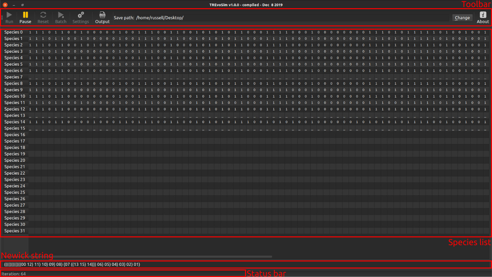
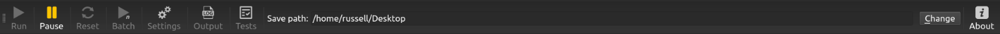

.. _windowlayout:

Window Layout
=============

The main window comprises a number of elements, outlined below.

Toolbar
-------
The main toolbar appears as follows when the simulation is not running:

And when it is running, as below:

The buttons control the simulation, as well as launching dialogues, and defining program output location.

:Run: This button launches a simulation, and then runs it until the requested number of species has evolved (see :ref:`settings` ), the simulation is paused, or cancelled (escape key).
:Pause: Pauses simulation, which can be resumed when requested by pressing pause again.
:Reset: Resets the simulation by removing all digital organisms from the playing field and species list.
:Batch: For repeated runs using the same settings, TREvoSim provides a batch mode. The number of runs is requested on launching batch mode, and output files are labelled accordingly.
:Settings: Launches :ref:`settings` dialogue.
:Output: Launches :ref:`loggingsim` dialogue.
:Save path: All files created by the program are written to a folder titled *TREvoSim_output*, created in this location.
:Change: Launches a file explorer to change the save path.
:About: Opens a dialogue with information about TREvoSim, and links to the code and for bug reporting.

Species list
------------

This panel updates as a run of the simulation progresses: it shows the binary string for the species in a simulation (up to the first 128 characters are displayed), once available. The panel starts as blank; once speciation occurs and any given species remains extant (i.e. there is a living representative in the playing field), the species is represented by a series of dashes. Once the species is extinct, and characters have been recorded (see algorithm description in Keating *et al.* 2019 for more details), these are printed to the panel.

Newick string
-------------

This text box updates with a Newick string showing the tree of the current simulation run, which updates as speciation events occur. This provides an immediate picture of, for example, the tree asymmetry within a run.

Status bar
----------

The status bar is updated with messages during and after a run: for example, during a run it displays the iteration number, and afterwards it can provide messages about the data (e.g. number of uninformative characters, if these are not set to be stripped out, number of identical terminals). It also displays progress bars where one is required.
